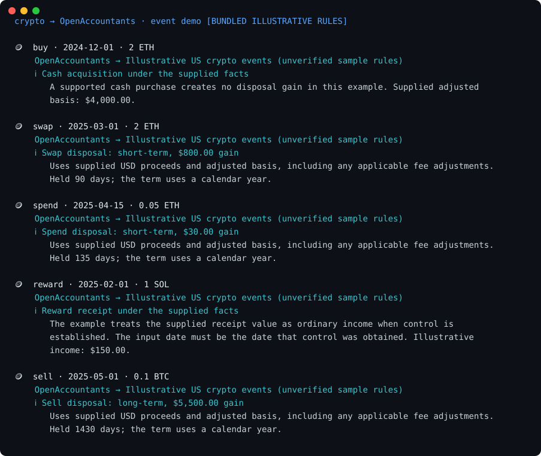

# crypto → OpenAccountants: crypto-tax demo

**The pitch in one line:** Your exchange/wallet/onchain history is a list of moves. OpenAccountants tells you which ones are **taxable events** and how — including the ones everyone gets wrong — signed off by a named licensed accountant. No keys, no signup.

```
transaction history (exchange CSV / Rotki export / onchain)
  └─ { buy, sell, swap, spend, reward }
        └─ OpenAccountants MCP  →  load the verified crypto-tax skill
              └─ Verdict:  ⚠️ crypto-to-crypto swap = taxable disposal (no cash needed)   ← the catch
                           ⚠️ spending crypto = taxable disposal
                           ⚠️ staking reward = ordinary income at receipt
                           ✅ long-held sale = long-term gain   ·   ℹ️ buy = not taxable
                 · gain + holding term computed
                 · the named CPA who signed off the rules
```



> Regenerate the visual: `python make_svg.py` (static SVG, no deps) · animated GIF: `brew install vhs && vhs demo.tape`

## Why this one

Crypto tax is where the most-confident wrong assumptions live. The single biggest: *"I didn't cash out, so I don't owe tax."* But in the US a **crypto-to-crypto swap is a disposal at fair value** — taxable the moment you trade ETH for SOL. Same for **spending** crypto, and **staking rewards** are ordinary income on receipt. OpenAccountants is the layer that knows which moves are events and which aren't.

- **The data source = the moves** (exchange, wallet, onchain).
- **OpenAccountants = the tax treatment**, with verified rules and a named accountant behind them.

## What it shows

A sample history run through the OpenAccountants MCP:

| Event | Verdict |
|---|---|
| Buy ETH with cash | ℹ️ Not taxable — sets cost basis |
| **Swap ETH → SOL** | ⚠️ **Taxable disposal — short-term gain (no cash received)** |
| **Spend ETH on a purchase** | ⚠️ **Taxable disposal** |
| Staking reward | ⚠️ Ordinary income at fair value |
| Sell long-held BTC | ✅ Long-term gain |

**The money shot:** the ETH→SOL **swap**. No dollars changed hands, so it *feels* tax-free — but it's a disposal of the ETH at fair value, with a real gain. Catching that (and the "spending crypto is a disposal" one) is exactly the value OpenAccountants adds on top of any wallet or exchange.

## Run it

```bash
git clone https://github.com/openaccountants/crypto-tax-demo
cd crypto-tax-demo
python pipeline.py                      # bundled sample history (mock mode, no keys)
python pipeline.py samples/transactions.json
```

### Go live

```bash
export OA_MCP_TOKEN=...     # OpenAccountants account token (uses the live verified rules)
python pipeline.py
```

## Files

| File | Role |
|------|------|
| `pipeline.py` | Orchestrator + CLI: history → OA → verdict report |
| `crypto_client.py` | Normalizes events from an exchange/Rotki/onchain export |
| `oa_client.py` | OpenAccountants MCP JSON-RPC client (live or mock) |
| `crypto_check.py` | Classifies each event → verdict |
| `samples/transactions.json` | A small transaction history |

## Honest notes

- `crypto_check.py` does **classification + gain + term, not an exact tax figure** (which needs total income, filing status, NIIT, wash-sale and specific-ID nuances). Production leans on the full OA skill + an agent step; the named-CPA sign-off makes the verdict relianceable.
- Rules (swap/spend as disposals, rewards as income, >1yr long-term cutoff) are 2025 US treatment; live, every value comes from `get_skill`. The verifier (Amir Pelinkovic) is the real OpenAccountants US lead.
